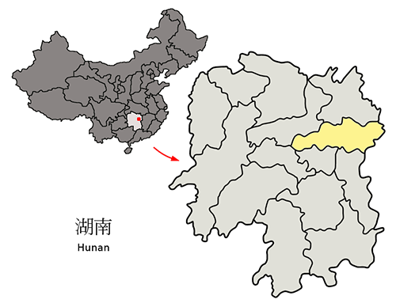
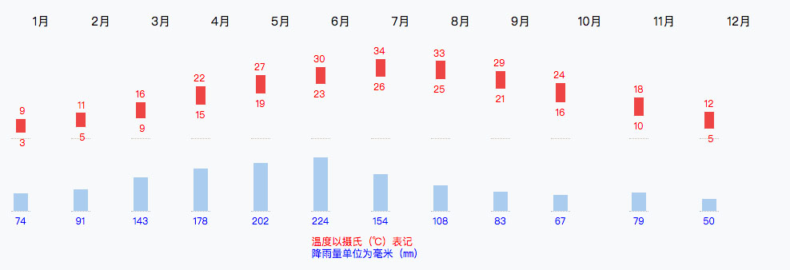
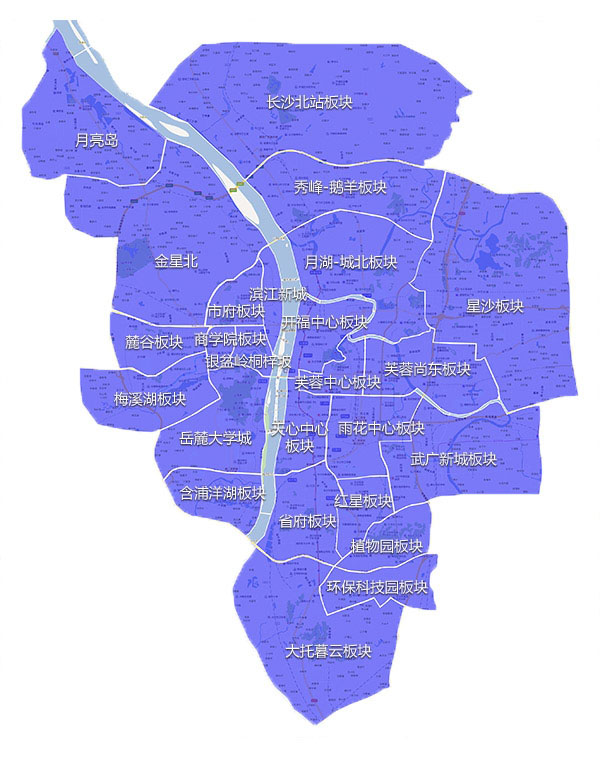
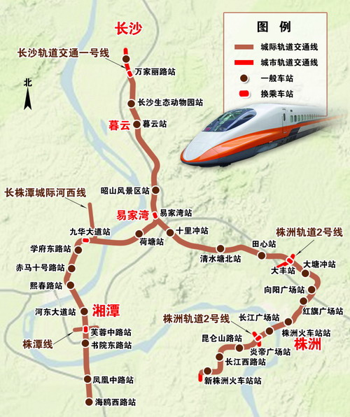

# 遇见长沙

## 地理位置
长沙位于中国的中南部的长江以南地区，湖南省的东部偏北。地处洞庭湖平原的南端向湘中丘陵盆地过渡地带，与岳阳、益阳、娄底、株洲、湘潭和江西萍乡接壤。总面积为11,819平方公里，其中市区面积1,939平方公里。湘江为长沙最重要的河流，由南向北贯穿全境，境内长度约75公里。湘江把城市分为河东和河西两大部分，河东以商业经济为主，河西以文化教育为主。2001年10月10日，市政府驻地由河东藩正街迁至河西观沙岭，力在发展河西的经济以平衡长沙两岸。

## 天气气候
长沙属亚热带季风气候，四季分明，降水充沛。春秋短促，冬夏绵长，充分体现了亚热带大陆性季风气候的典型特点。长沙距海较远，又位于冲积盆地，边缘地势高峻，向北倾斜，北方冷空气可深入聚集，冬季比同纬度地区稍冷，而夏季比同纬度地区更热，是江南“四大火炉”之一。长沙降雨不均匀，3～5月平均降雨日数有49.4天，约占全年总降雨日数的35％。夏季降水不均，旱涝无定。秋冬降水明显减少。长沙地区日照时数达1541.9小时，作物生长期长。冬春多偏北风，夏季多偏南风，全年保持着温和湿润的气候特点，因此长沙的冬季并不萧索，常绿的阔叶树，如香樟、女贞等仍然葱笼滴翠，唐代杜荀鹤有诗云：“残腊泛舟何处好，最多吟兴是滞湘”。水资源以地表水为主，水源充足，年均地表径流量达808亿立方米。除湘江外，还有15条汇入湘江的支流，主要有浏阳河、捞刀河、靳江和沩水河。最大的水库为宁乡市境内的黄材水库和浏阳市境内的朱树桥水库。

## 行政区划
长沙市现辖6个市辖区、1个县，代管2个县级市。
- 市辖区：芙蓉区、天心区、岳麓区、开福区、雨花区、望城区
- 县级市：浏阳市、宁乡市
- 县：长沙县

[长沙市基层区划概况](./长沙市基层区划概况.md)

## 中心城区
一般是指内五区（芙蓉区，岳麓区，天心区，开福区，雨花区）

## 副中心
梅溪湖国际新城二期

## 房产板块区划图

## 限购区域
城六区，及长沙县

<!-- ## 轨道交通

 -->

